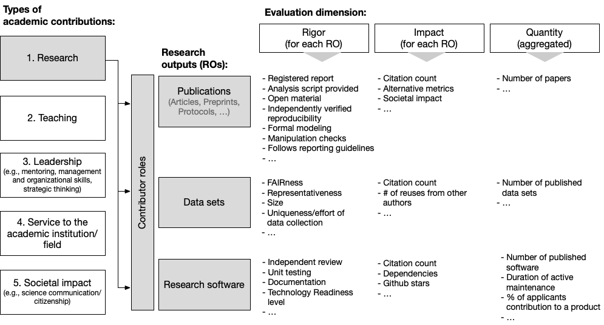

# RESQUE: The Research Quality Evaluation scheme for psychological research

The **Research Quality Evaluation (RESQUE)** framework provides recommendations for a responsible research assessment that does not rely on flawed metrics such as the journal impact factor or the h-index. It provides objective quality and impact indicators for three types of research outputs:
(a) publications of empirical studies, (b) published data sets and (c) research software. It is primarily developed for the field of psychology, but might be easily transferred to neighbouring empirical scientific fields.

In the spirit of [CoARA](https://coara.eu), it recognises diverse academic outputs, emphasizes quality over quantity, and combines qualitative peer review by responsible use of quantitative indicators. Its main intended use is to aid decisions in hiring and tenure committees.

This repository is used for continuous development, versioning, and issue tracking.
Stable releases are tagged here and are mirrored to a [project on OSF](https://osf.io/4wynr/wiki/home/).
(The OSF project is intended to be a landing page for end-users not acquainted with Github).

**Table of content:**

- [RESQUE: The Research Quality Evaluation scheme for psychological research](#resque-the-research-quality-evaluation-scheme-for-psychological-research)
  - [Publications and commentaries by the scientific community](#publications-and-commentaries-by-the-scientific-community)
    - [Publications](#publications)
    - [Commentaries](#commentaries)
  - [Resources](#resources)
    - [Rating sheets (core set)](#rating-sheets-core-set)
    - [☑️ Rating sheets (expansion packs)](#️-rating-sheets-expansion-packs)
    - [📔 Coding manual](#-coding-manual)
    - [🧑‍💻 Analysis scripts for R](#-analysis-scripts-for-r)
  - [🚀 How to contribute / Expansion packs](#-how-to-contribute--expansion-packs)
  - [How to get started](#how-to-get-started)
    - [...as hiring committees](#as-hiring-committees)
    - [... as applicants](#-as-applicants)

## Publications and commentaries by the scientific community

### Publications

The *general framework* of RESQUE is described in:

> [1]  Schönbrodt, F. D., Gärtner, A., Frank, M., Gollwitzer, M., Ihle, M., Mischkowski, D., … Leising, D. (2022, November 25). Responsible Research Assessment I: Implementing DORA for hiring and promotion in psychology. [https://doi.org/10.31234/osf.io/rgh5b](https://doi.org/10.31234/osf.io/rgh5b)

The *specific RESQUE rating scheme* is described in:

> [2]  Gärtner, A., Leising, D., & Schönbrodt, F. D. (2022, November 25). Responsible Research Assessment II: A specific proposal for hiring and promotion in psychology. [https://doi.org/10.31234/osf.io/5yexm](https://doi.org/10.31234/osf.io/5yexm)

and

> [3]  Gärtner, A., Leising, D., & Schönbrodt, F. D. (2023). Empfehlungen zur Bewertung wissenschaftlicher Leistungen bei Berufungsverfahren in der Psychologie. Psychologische Rundschau, 74(3), 166–174. [https://doi.org/10.1026/0033-3042/a000630](https://doi.org/10.1026/0033-3042/a000630)

(Note: these publications refer to version 0.1 of the RESQUE scheme; as the rating scheme will be continuously updated based on community feedback and ongoing evaluation studies, some divergences to these publications will arise).

### Commentaries

You can find 15 comments to our taget paper [1] published in Meta-Psychology:

TODO

Furthermore, there are 6 additional commentaries (in German) published in the [Psychologische Rundschau](https://econtent.hogrefe.com/toc/pru/74/3):

- Lange, J., Degner, J., Gleibs, I. H., & Jonas, E. (2023). Fachgruppe Sozialpsychologie: Faires und valides Shortlisting in Phase 1. Psychologische Rundschau, 74(3), 187–190. [https://doi.org/10.1026/0033-3042/a000641](https://doi.org/10.1026/0033-3042/a000641)
- Niessen, C., Melchers, K. G., Ohly, S., Fay, D., Handke, L., & Kern, U. M. (2023). Fachgruppe Arbeits-, Organisations- und Witschaftspsychologie: Ein Plädoyer für breit gewählte und anforderungsbezogene Leistungsindikatoren. Psychologische Rundschau, 74(3), 180–182. [https://doi.org/10.1026/0033-3042/a000637](https://doi.org/10.1026/0033-3042/a000637)
- Ortner, T., Kretzschmar, A., Rauthmann, J. F., & Tibubos, A. N. (2023). Fachgruppe Differentielle Psychologie, Persönlichkeitspsychologie und psychologische Diagnostik: Berufungsverfahren unter einer diagnostischen Perspektive fundiert durchführen. Psychologische Rundschau, 74(3), 182–184. [https://doi.org/10.1026/0033-3042/a000638](https://doi.org/10.1026/0033-3042/a000638)
- Schwartz, B., Szota, K., Schmitz, J., Lueken, U., & Lincoln, T. (2023). Fachgruppe Klinische Psychologie und Psychotherapie: Mehr Differenzierung nach Fachgebieten. Psychologische Rundschau, 74(3), 184–185. [https://doi.org/10.1026/0033-3042/a000639](https://doi.org/10.1026/0033-3042/a000639)
- Sparfeldt, J. R., Spörer, N., Greiff, S., & Schneider, R. (2023). Fachgruppe Pädagogische Psychologie: Ein Plädoyer für valide‍(re) Bewertungen der wissenschaftlichen Leistungen in Berufungsverfahren. Psychologische Rundschau, 74(3), 185–187. [https://doi.org/10.1026/0033-3042/a000640](https://doi.org/10.1026/0033-3042/a000640)
- Stroebe, W., & Strack, F. (2023). Kommentare zu Gärtner, A. et al. (2023). Empfehlungen zur Bewertung wissenschaftlicher Leistungen bei Berufungsverfahren in der Psychologie: Zweierlei Maß? Warum manche Psychologen den Gebrauch von quantitativen Indikatoren der Forschungsqualität ablehnen. Psychologische Rundschau, 74(3), 175–179. [https://doi.org/10.1026/0033-3042/a000631](https://doi.org/10.1026/0033-3042/a000631)

## Resources

### Rating sheets (core set)
Versioned releases of the rating sheets are provided as offline Excel files in the folder [/rating_sheets](/rating_sheets). The goal is to make data entry for applicants and hiring committees as easy and frictionless as possible.

There are three separate sheets for ...

- Publications, preprints, book chapters, etc. (**RESQUE-Text**): [Current release (v0.1)](/rating_sheets/RESQUE_text_v0_1.xlsx) - [Development version](https://docs.google.com/spreadsheets/d/1SUhwiZnhFCjy5COga3utGO15KT2wD4Pk/edit?usp=sharing&ouid=108982640291853577145&rtpof=true&sd=true)
- Data sets (**RESQUE-Data**): [Current release (v0.1)](/rating_sheets/RESQUE_data_v0_1.xlsx) - Development version
- Research software (**RESQUE-Software**): [Current release (v0.1)](/rating_sheets/RESQUE_software_v0_1.xlsx) - Development version

The rating sheets are versioned, and all indicators from the core set start with the prefix "Q". The current development version is in a Google sheet.

### ☑️ Rating sheets (expansion packs)

One purpose of this central landing page is to collect disciplinary **expansion packs (EPs)** with specific indicators that relevant for a subfield. Here is a minimal technical specification for expansion packs, in order to increase interoperability:

- Use xlsx files, comparable to the RESQUE core sheets
- Each indicator gets a unique ID, starting with a prefix specific to the expansion pack (e.g., "CP1", "CP2" for the "Clinical Psychology" expansion pack).

Such EPs ideally are contributed from a legit academic community and stem from a consensus process.

*Currently, there are no expansion packs available.*

### 📔 Coding manual
The coding manual is a companion to the rating schemes and gives guidance on how to apply the ratings. It includes examples and a discussion of boundary cases.
The goal of the coding manual is to increase interrater reliability, in particular when external raters apply the scheme to research outputs (in contrast to applicants rating their own research).

Active development of the manual takes place in a [Google doc](https://docs.google.com/document/d/1jEFQ6Klpgc3uQQMKZDEfGmJLp1WSSVNjadTAHULLJk4/edit?usp=sharing); tagged releases are stored in the folder [/coding_manual](./coding_manual).

### 🧑‍💻 Analysis scripts for R
We provide R scripts that ...

1. read and aggregate multiple xlsx files with rating data
2. enrich the data with other sources of information (e.g. citation counts & normalized citation counts from [OpenAlex](https://openalex.org))
3. tenure committees

Make sure that the version of the R script matches the version of the rating sheet - otherwise it will probably not work.

## 🚀 How to contribute / Expansion packs

For minor updates and minor feature requests, please use the [issue tracker](https://github.com/nicebread/RESQUE/issues).

If you want to collaborate scientifically on the project, please contact one of the project maintainers ([Felix Schönbrodt](mailto:felix.schoenbrodt@psy.lmu.de); [Anne Gärtner](mailto:anne_gaertner@tu-dresden.de); [Daniel Leising](mailto:Daniel.Leising@tu-dresden.de)).

## How to get started

### ...as hiring committees

TODO

- Show recommended paragraph in job ad
- Instructions for applicants
- How to aggregate the xlsx files

### ... as applicants

TODO

- How to use the xlsx sheets
- 
