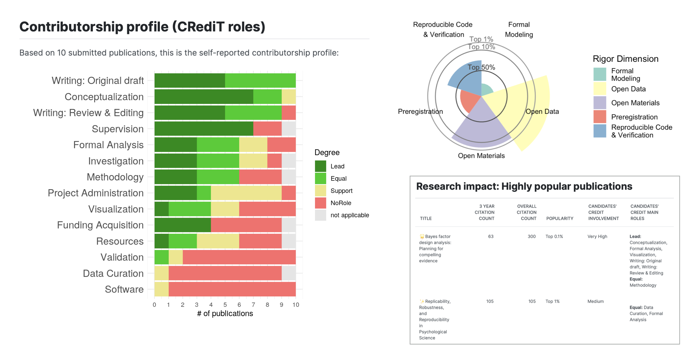

::: {.callout-warning title="Warning: App still under development" collapse="true"}
The [Collector App](https://resque-framework.github.io/collector-app/) for entering the data, the [R package for profile creation](https://github.com/RESQUE-Framework/RESQUER), and the [Profile Builder](https://shiny.psy.lmu.de/felix/RESQUE_profile/) website where end-users can retrieve their profile are under development and not finalized yet.
Things might change substantially in the near future. If you want to use the RESQUE framework in practice please [contact](/team.qmd) us.
:::

# How can I enter my data and get a profile?

Choose the option that matches your use case:

```{=html}
<div class="applicant-path-grid">
    <a class="applicant-path-card" href="#tab-hiring-committee">
        <span class="applicant-path-card__title">
            <svg class="applicant-path-card__icon" viewBox="0 0 24 24" aria-hidden="true" xmlns="http://www.w3.org/2000/svg">
                <path d="M7 4h7l5 5v9a2 2 0 0 1-2 2H7a2 2 0 0 1-2-2V6a2 2 0 0 1 2-2z" fill="none" stroke="currentColor" stroke-width="1.8" stroke-linejoin="round"/>
                <path d="M14 4v5h5" fill="none" stroke="currentColor" stroke-width="1.8" stroke-linejoin="round"/>
                <path d="M9 13l2 2 4-4" fill="none" stroke="currentColor" stroke-width="1.8" stroke-linecap="round" stroke-linejoin="round"/>
            </svg>
            The hiring committee requested a RESQUE profile
        </span>
        <span class="applicant-path-card__text">Enter your best publications and send the data file to the committee.</span>
    </a>

    <a class="applicant-path-card" href="#tab-proactive-profile">
        <span class="applicant-path-card__title">
            <svg class="applicant-path-card__icon" viewBox="0 0 24 24" aria-hidden="true" xmlns="http://www.w3.org/2000/svg">
                <circle cx="12" cy="8" r="3.2" fill="none" stroke="currentColor" stroke-width="1.8"/>
                <path d="M6 19a6 6 0 0 1 12 0" fill="none" stroke="currentColor" stroke-width="1.8" stroke-linecap="round"/>
                <path d="M18.5 6.5h3m-1.5-1.5v3" fill="none" stroke="currentColor" stroke-width="1.8" stroke-linecap="round"/>
            </svg>
            Pro-actively create a RESQUE profile for your CV or homepage
        </span>
        <span class="applicant-path-card__text">Create a broader profile from selected publications and use it in your personal academic materials.</span>
    </a>

    <a class="applicant-path-card" href="#tab-single-publication">
        <span class="applicant-path-card__title">
            <svg class="applicant-path-card__icon" viewBox="0 0 24 24" aria-hidden="true" xmlns="http://www.w3.org/2000/svg">
                <path d="M7 4h10a2 2 0 0 1 2 2v12a2 2 0 0 1-2 2H7a2 2 0 0 1-2-2V6a2 2 0 0 1 2-2z" fill="none" stroke="currentColor" stroke-width="1.8"/>
                <path d="M9 9h6M9 13h6M9 17h4" fill="none" stroke="currentColor" stroke-width="1.8" stroke-linecap="round"/>
            </svg>
            Create a RESQUE profile for a single publication
        </span>
        <span class="applicant-path-card__text">Generate a profile for a publication that you can include at the journal submission, or as an open quality checklist in the supplementary material.</span>
    </a>
</div>
```

::: {.panel-tabset .applicant-path-tabset}
### ... for a hiring committee

```{=html}
<div id="tab-hiring-committee"></div>
```

1. Enter the data in the RESQUE Collector App of the specific hiring committee (usually committees provide a custom link). Committees can choose different sets of indicators and set a limit of how many publications should be minimally and maximally provided.
2. Save the data as a local `json` file (**Save to file ...**).
3. Send the exported `json` file from Step 2 to the committee.
4. (optional, for your personal use) Open the [RESQUE Profiler](https://shiny.psy.lmu.de/felix/RESQUE_profile/), upload the `json` file, and generate the profile as an html file. The committee will create the profile themselves based on your `json` file.

**Important notes**:

Only publications with sufficient data on the indicators can be fully processed (see "Problems" in the top right corner of the Collector App - if there no problems are shown, everything is fine.). Hence, bulk importing publications from ORCID without adding the indicator information does not help; such publications will be excluded from the profile.


### ... for your CV

```{=html}
<div id="tab-proactive-profile"></div>
```

1. Select the publications you want your profile to represent and enter them in the generic [RESQUE Collector App](https://resque-framework.github.io/collector-app).
2. Save the data as a local `json` file (**Save to file ...**).
3. Upload the file to the [RESQUE Profiler](https://shiny.psy.lmu.de/felix/RESQUE_profile/) to create an html profile.
4. Add the resulting profile to your CV or personal website.

This option is useful when you want to present a concise RESQUE profile of your research even without an explicit committee request.

### ... for a single publication

```{=html}
<div id="tab-single-publication"></div>
```

1. Enter the information for a publication in the generic [RESQUE Collector App](https://resque-framework.github.io/collector-app).
2. On the top right of the middle pane, click the "Print" button. In the print dialog of your browser, you can export the print as a PDF file. 
3. (optional, but recommended) Save the data as a local `json` file (**Save to file ...**), so that you can later change values.


You can use that report as an in-depth, transparent quality checklist. Include it when you submit your manuscript to a journal, or include it in the supplementary material. Some journals already require a "Open Research Practice" statement - with this RESQUE checklist, you get a much more detailed summary of your open research practices.
:::


---

```{=html}
<script>
document.addEventListener("DOMContentLoaded", function () {
    const activateApplicantTab = () => {
        const hash = window.location.hash;
        if (!hash) {
            return;
        }

        const target = document.querySelector(hash);
        if (!target) {
            return;
        }

        const pane = target.closest(".tab-pane");
        if (!pane) {
            return;
        }

        const trigger = document.querySelector(
            '[data-bs-target="#' + pane.id + '"]' +
            ', a[href="#' + pane.id + '"]'
        );

        if (trigger && window.bootstrap && window.bootstrap.Tab) {
            window.bootstrap.Tab.getOrCreateInstance(trigger).show();
        }
    };

    document.querySelectorAll(".applicant-path-card").forEach(function (card) {
        card.addEventListener("click", function (event) {
            event.preventDefault();

            const hash = card.getAttribute("href");
            if (!hash) {
                return;
            }

            history.replaceState(null, "", hash);
            activateApplicantTab();

            const tabset = document.querySelector(".applicant-path-tabset");
            if (tabset) {
                tabset.scrollIntoView({ behavior: "smooth", block: "start" });
            }
        });
    });

    window.addEventListener("hashchange", activateApplicantTab);
    activateApplicantTab();
});
</script>
```

```{=html}
<section class="demo-profile-card" aria-labelledby="demo-profile-title">
    <a class="demo-profile-card__image-link" href="/includes/demo_profile.html">
        
    </a>

    <div class="demo-profile-card__content">
        <p class="demo-profile-card__eyebrow">Interactive Example</p>
        <h3 id="demo-profile-title" class="demo-profile-card__title">Open the Demo Profile</h3>
        <p class="demo-profile-card__description">
            Explore a full RESQUE example profile in your browser. Use this to see the final layout applicants and committees receive.
        </p>
        <a class="demo-profile-card__button" href="/includes/demo_profile.html">
            <svg class="demo-profile-card__button-icon" viewBox="0 0 24 24" aria-hidden="true" xmlns="http://www.w3.org/2000/svg">
                <path d="M14 5h5v5" fill="none" stroke="currentColor" stroke-width="2" stroke-linecap="round" stroke-linejoin="round"/>
                <path d="M10 14 19 5" fill="none" stroke="currentColor" stroke-width="2" stroke-linecap="round" stroke-linejoin="round"/>
                <path d="M19 13v5a1 1 0 0 1-1 1H6a1 1 0 0 1-1-1V6a1 1 0 0 1 1-1h5" fill="none" stroke="currentColor" stroke-width="2" stroke-linecap="round" stroke-linejoin="round"/>
            </svg>
            Go to demo profile
        </a>
    </div>
</section>
```

### Frequently Asked Questions of Applicants

::: {.faq}

<details class="faq">
<summary>❓ <strong>What is a good strategy for choosing my 10 best publications? Does it make sense to enter multiple (sub)studies of my multi-study paper as separate publications?</strong></summary>
TBD
</details>

:::