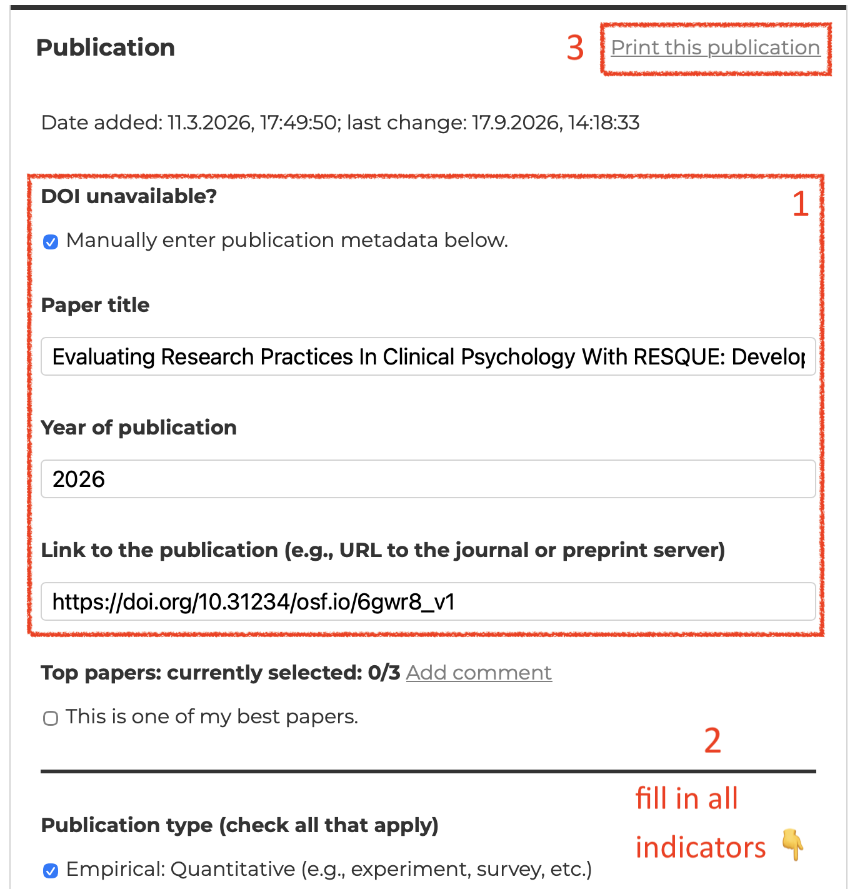
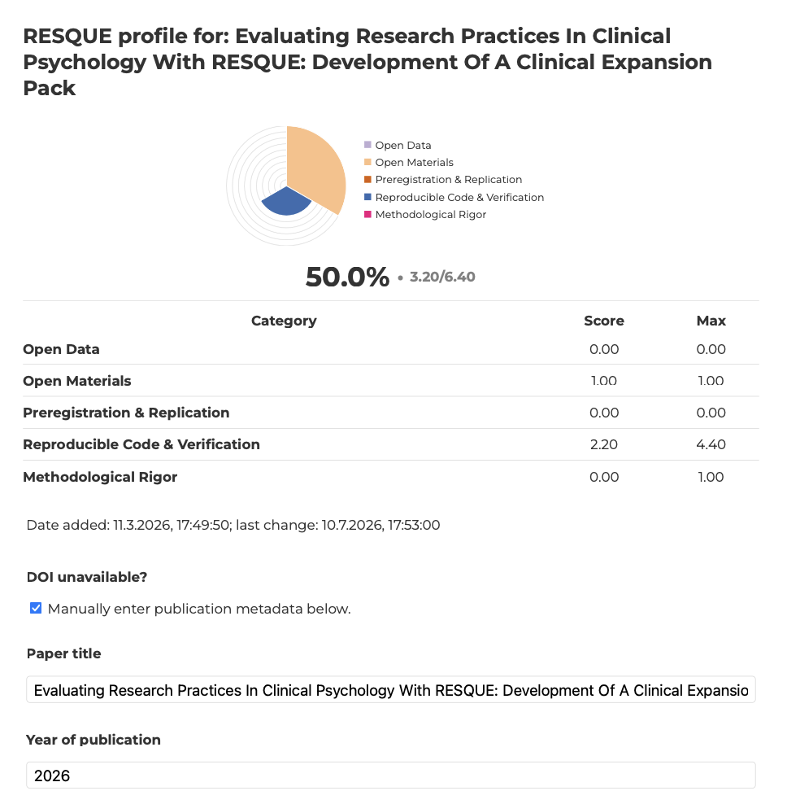

New feature: You can now create RESQUE profiles for single papers.
Just enter a single publication into the [Collector App](https://resque-framework.github.io/collector-app/) (you can ignore the *Author / Metadata* tab for that).

{width="500" .screenshot}

1. If it is a preprint and has no doi yet (or the newly assigned doi does not provide the correct metadata yet), check "DOI unavailable?" and enter the metadata (title, year, URL) manually.
2. Fill in all indicators.
3. On the top right of the middle pane, click "Print this publication". This will open your operating system's print dialog, from which you can export the report as PDF.

You can see an example of the [Paper Profile](https://osf.io/fmqv5/files/39ywd?view_only=e484fb8461624736a8a5050008cdf5a7) for our recent [preprint](https://doi.org/10.31234/osf.io/6gwr8_v1) where we evaluated the [Expansion Pack Clinical Psychology](../tech_doc/EP-clinical_psychology.qmd):

{width="500" .screenshot}
