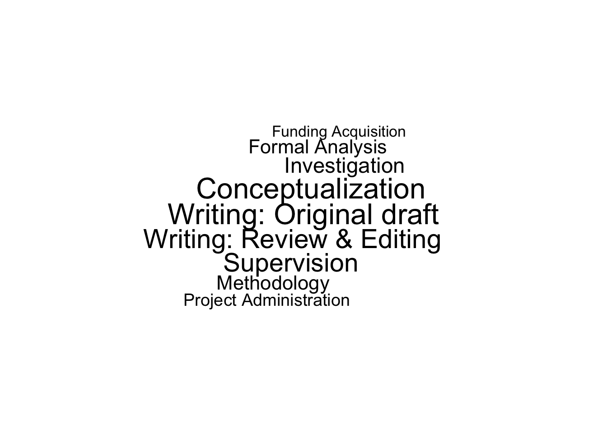
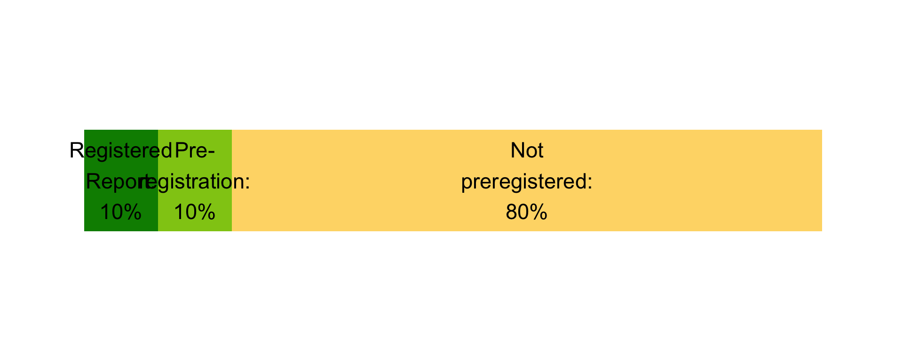
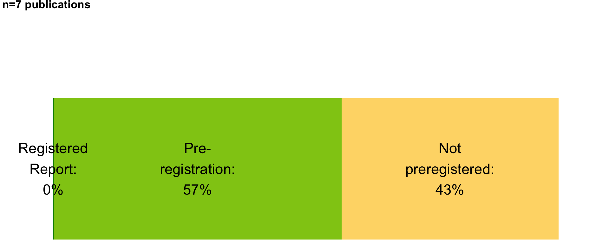
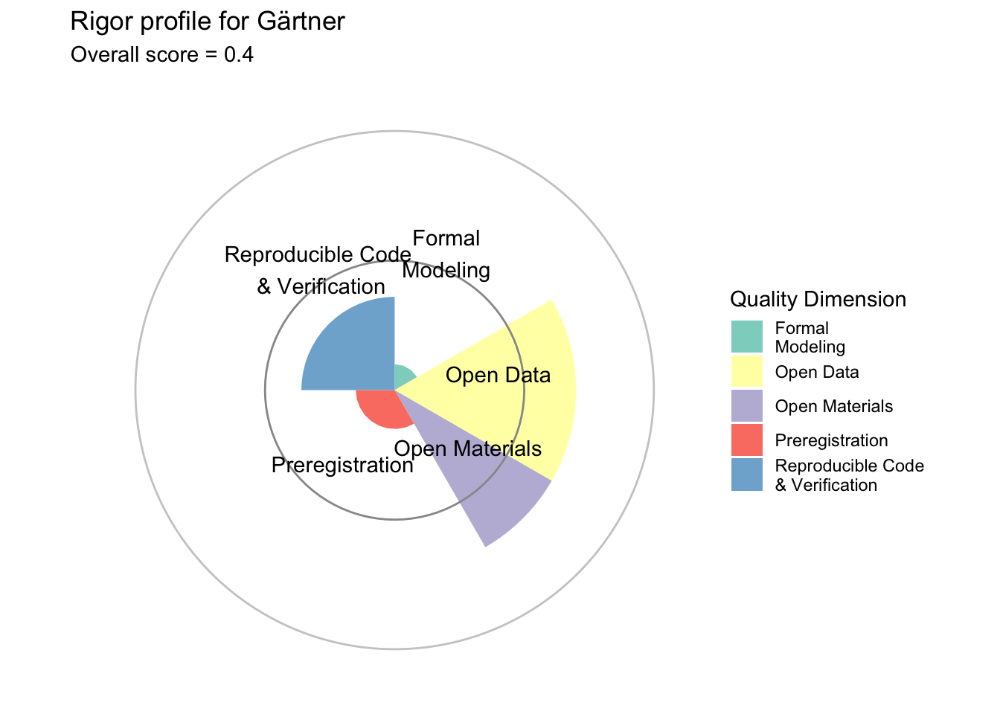
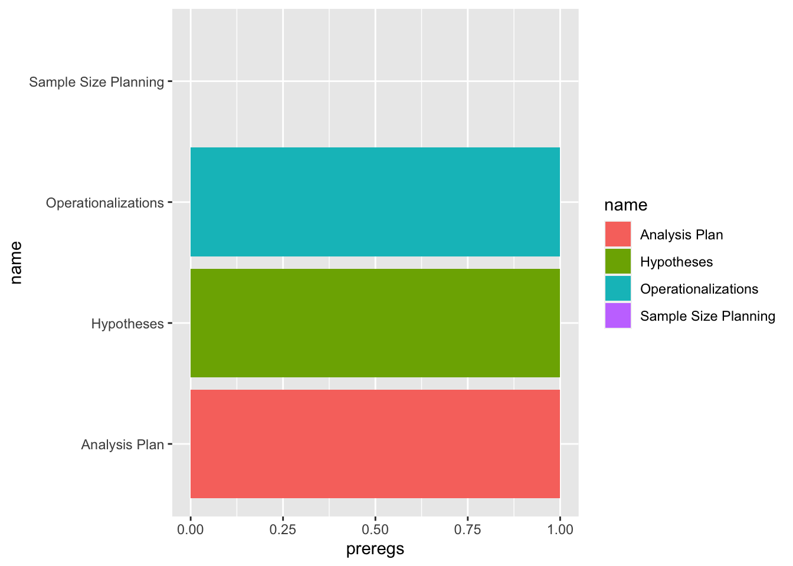

<!-- 

TODOs:

 - The accompanying R-scripts support this manual step by presenting a concise overview of all “not applicable” claims of all applicants.

 -->

::: {.cell}

:::

This document summarizes the research style of a scientist - **the "fingerprint" of how research is conducted**, when only the best work is submitted to this analysis.

Some parts of this profile are purely descriptive. For example, it is summarized whether researchers focus on lab or field studies, whether they predominantly work with psychophysiological data or rather focus on questionnaire studies. 

Other parts are, to some extent, normative: Research that is reproducible, which allows independent auditing because it provides open data and scripts, or prevents biases by preregistration is, *ceteris paribus*, better than research that does not have these aspects. Research outputs with these objective quality criteria of methodological rigor can gain "bonus points" which are summed across all provided research outputs.

## Submitted research outputs

10 research outputs have been submitted. The following table shows the types of submitted outputs, and whether they have been flagged as suitable for the rating sheet (*yes*) or not (*no*).

::: {.cell}
::: {.cell-output-display}

|                  | No| Yes|
|:-----------------|--:|---:|
|Publication       |  3|   7|
|Data set          |  0|   0|
|Research software |  0|   0|

:::
:::

The 10 publications had the following types:

::: {.cell}
::: {.cell-output-display}

|Var1            | Freq|
|:---------------|----:|
|Monograph       |    1|
|Preprint        |    1|
|Published Paper |    8|

:::
:::

And the following methodological type:

::: {.cell}
::: {.cell-output-display}

|Type of method | # papers|
|:--------------|--------:|
|Empirical      |        6|
|Meta Analysis  |        0|
|Other Method   |        0|
|Simulation     |        0|
|Theoretical    |        4|

:::
:::

### Team science in publications?

7 out of 10 submitted publications could be automatically retrieved with openAlex.

::: {.callout-caution collapse="true"}

## The following papers could *not* be retrieved by openAlex:

|   |Title                                                                                                   |Year |doi                |P_TypePublication |
|:--|:-------------------------------------------------------------------------------------------------------|:----|:------------------|:-----------------|
|4  |Visual Argument Structure Tool (VAST) Version 1.0                                                       |2023 |[https://doi.org/NA](https://doi.org/NA)|Published Paper   |
|6  |Ten steps toward a better personality science – how quality may be rewarded more in research evaluation |2022 |[https://doi.org/NA](https://doi.org/NA)|Published Paper   |
|10 |A mathematical model of person judgment (part 1)                                                        |2023 |[https://doi.org/NA](https://doi.org/NA)|Preprint          |

:::

::: {.cell}
::: {.cell-output-display}

|Team category                | Frequency|   %|
|:----------------------------|---------:|---:|
|Single authored              |         0|  0%|
|Small team (<= 5 co-authors) |         6| 86%|
|Large team (6-15 co-authors) |         1| 14%|
|Big Team (> 15 co-authors)   |         0|  0%|

:::
:::

## Contributorship profile (CRediT roles)

Based on 10 submitted publications, this is the self-reported contributorship profile:

::: {.cell}
::: {.cell-output-display}
{width=672}
:::
:::

::: {.cell}
::: {.cell-output-display}
{width=672}
:::
:::

# Open Data in Publications

Out of 7 suitable publications, 6 had empirical data. These represent the base for the following analyses.

TBD

## Correctness of computational results has been independently verified

::: {.cell}

:::

6 papers had empirical data. Of these analysis have been independently verified for computational correctness:

::: {.cell}
::: {.cell-output-display}
{width=960}
:::
:::

## Was the research preregistered / a registered report?

::: {.cell}
::: {.cell-output-display}
{width=960}
:::
:::

## Replication: The publication contained a preregistered replication attempt (either direct/close or conceptual)

::: {.cell}
::: {.cell-output-display}
{width=960}
:::
:::

## What has been preregistered?

::: {.cell}

:::

4 of 7 eligible publications had preregistrations. The following components have been preregistered (relative to 4 preregistrations):

::: {.cell}
::: {.cell-output-display}
{width=672}
:::
:::

## "Not applicable" justifications

Choosing "not applicable" indicates that an indicator *principally* cannot be attained by a research output. To avoid bias against certain research fields, the points of such non-applicable indicators are removed from the maximum points and therefore do not lower the computed relative rigor score. However, in order to prevent gaming of this scheme, any "not applicable" claim needs to be justified. Only when the justification is accepted by the committee, the point is removed. With no or insufficent justification, in contrast, the indicator is set to "not available" (=0 points) and the maximum points are not adjusted.

These are all claims of non-applicability from this applicant:

### P_Data_Open

|Title                                                                         |Year |P_Data_Open   |P_Data_Open_NAExplanation                                                                                                                                                                  |
|:-----------------------------------------------------------------------------|:----|:-------------|:------------------------------------------------------------------------------------------------------------------------------------------------------------------------------------------|
|[Sexual Harassment and Coercion in German Academia: A Large-Scale Survey Study](https://doi.org/10.5964/sotrap.9349)|2022 |NotApplicable |Data of very sensitive nature. Participants were assured of confidential treatment of all records. Data is stored in a persistent fashion on a university server, but access is restricted |

### 'This output is generally not suitable for the assessment scheme'
::: {.cell-output-display}

|Title                                                                                                   |Year |P_Suitable |P_Suitable_Explanation                      |
|:-------------------------------------------------------------------------------------------------------|:----|:----------|:-------------------------------------------|
|[Visual Argument Structure Tool (VAST) Version 1.0](https://open.lnu.se/index.php/metapsychology/article/view/2911)|2023 |No         |This is an entirely conceptual contribution |
|[Ten steps toward a better personality science – how quality may be rewarded more in research evaluation](https://ps.psychopen.eu/index.php/ps/article/view/6029)|2022 |No         |Purely conceptual contribution              |
|[The judgment of personality: an overview of current empirical research findings](https://doi.org/10.5964/ps.6043)|2021 |No         |Review Paper                                |

:::
