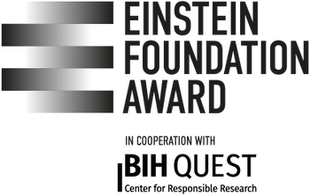

The RESQUE framework is a collaborative project initiated by the German Psychological Society ([DGPs](https://www.dgps.de)). 

Please contact [📧 felix.schoenbrodt@psy.lmu.de](mailto:felix.schoenbrodt@psy.lmu.de) for all questions about RESQUE.

## The RESQUE community

This project is a community effort with many contributors:

- The project is **coordinated** by [Felix Schönbrodt](http://www.nicebread.de), [Anne Gärtner](https://tu-dresden.de/mn/psychologie/ifap/differentielle-psychologie/die-professur/Mitarbeiter/dipl-psych-anne-gaertner), [Daniel Leising](https://tu-dresden.de/mn/psychologie/iaosp/diagnostische/die-professur/inhaber-in), [Anna-Lena Schubert](https://methoden.amd.psychologie.uni-mainz.de/schubert/) and the [CoARA Working Group of the DGPs](https://www.dgps.de/schwerpunkte/coara/)
- The **core indicator set** was developed by Anne Gärtner, Daniel Leising and Felix Schönbrodt, partly based on previous work by Daniel Leising, Isabel Thielmann, Andreas Glöckner, Anne Gärtner & Felix Schönbrodt (see [Leising et al., 2022](https://doi.org/10.5964/ps.6029).)
- [Alp Kaan Aksu](https://github.com/alpkaanaksu) is the lead programmer who designed and programmed the [**RESQUE Collector App**](https://resque-framework.github.io/collector-app)
- Maximilian Ernst, Aaron Peikert and Felix Schönbrodt had a leading role in the development of the **RESQUE-Software** scheme
- Nele Freyer, Jens Lange, Daniel Leising, Philipp Musfeld, and Felix Schönbrodt developed the [indicators for formal theory development and evaluation](tech_doc/EP-theorizing.qmd)
- Juliane Burghardt, Jakob Fink-Lamotte, Kevin Hilbert, Niklas Jacobs, Anja Kraeplin, Anne Möllmann, Helen Niemeyer, and Felix Schönbrodt developed the [Expansion Pack Clinical Psychology](tech_doc/EP-clinical_psychology.qmd)
- Daniel Nüst contributed to the **code verification indicator** in RESQUE-Pubs
- Dejana Damjanovic, Gracia Prüm, Elina Schweppe, Leonie Vogelsang and Martin Wiehr coded many papers and created the first "norm" sample

... all who wrote [comments](publications.qmd) with many constructive suggestions
... and many more who gave extended feedback across multiple years of development! 🙏

## How to contribute

Join our [**mailing list**](https://www.listserv.dfn.de/sympa/info/psy-dora) to receive news and updates about the RESQUE framework.

For **minor updates** and **minor feature requests**, please use the [Discussions](https://github.com/orgs/RESQUE-Framework/discussions) of the [Github repository](https://github.com/RESQUE-Framework).

If you want to **collaborate scientifically** on the project, please contact one of the project maintainers ([📧 Felix Schönbrodt](mailto:felix.schoenbrodt@psy.lmu.de); [📧 Anne Gärtner](mailto:anne_gaertner@tu-dresden.de); [📧 Anna-Lena Schubert](mailto:anna-lena.schubert@uni-mainz.de)).

If you want to **develop an expansion pack** for your field, please contact [📧 Anne Gärtner](mailto:anne_gaertner@tu-dresden.de).

Please note and respect our [Code of Conduct](/CODE_OF_CONDUCT.md).

## Partners and supporters of RESQUE

::: {layout-ncol=3}

:::
